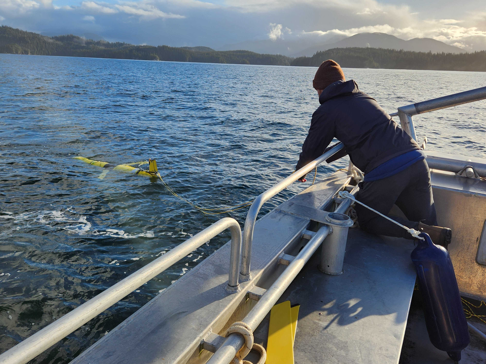

<!-- Start Writing Below in Markdown -->

When glider ``dfo-bumblebee`` came back to shore with low batteries after two successful occupations of the [Southern Line](/observatory/), weather was looking bad offshore
of Tofino.  This meant that it was not safe for our usual partners, the Canadian Coast Guard, to help recover.  Instead we asked [Bamfield Marine
Science Centre](https://bamfieldmsc.com) if they could provide support. Imperial Eagle Inlet is still open water, but it is much more sheltered than offshore Tofino! James Pegg and Nick Harper recovered ``dfo-bumblebee`` (with 4% nominal battery!) with the help of Bamfield Skipper Dave Porter (on a weekend, no less).  They also deployed ``dfo-marvin`` for another occupation, which if successful, will mean we have occupied the Southern Line for a full year.  Thanks to Bamfield, and the C-PROOF team for their hard work!

