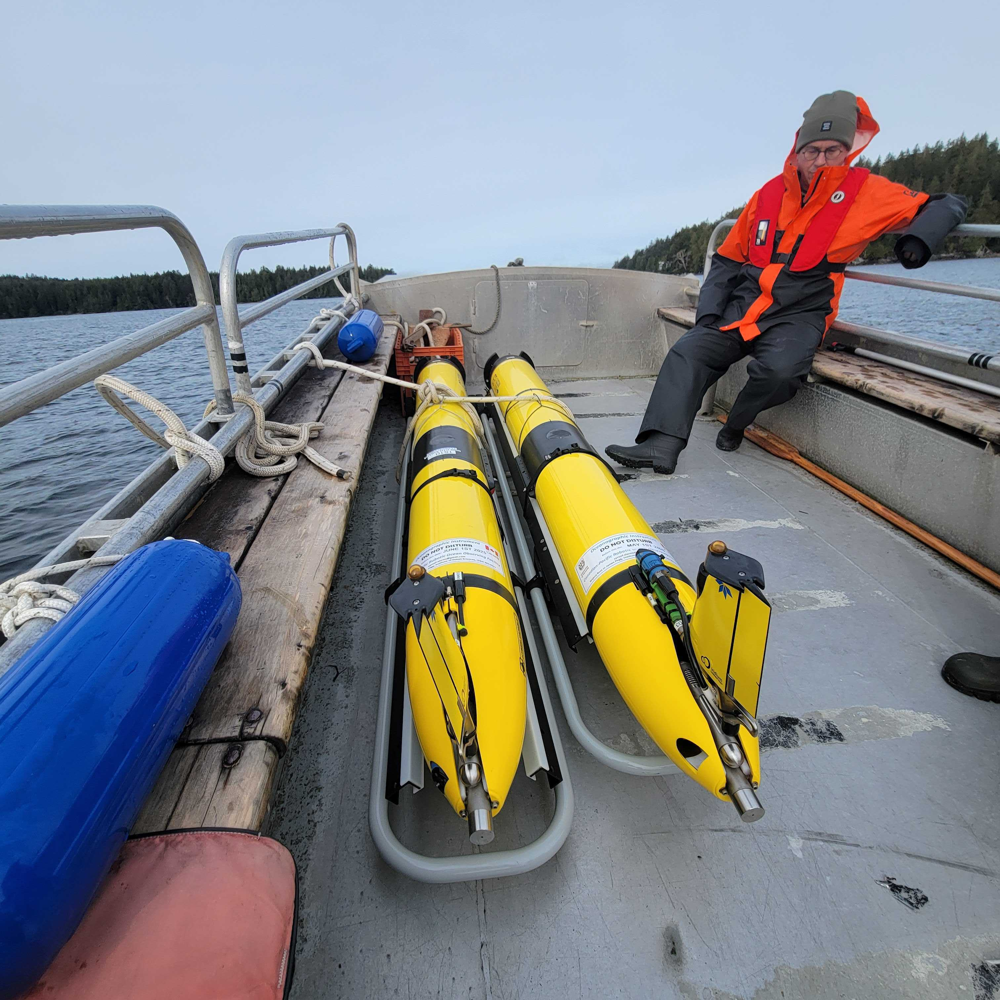
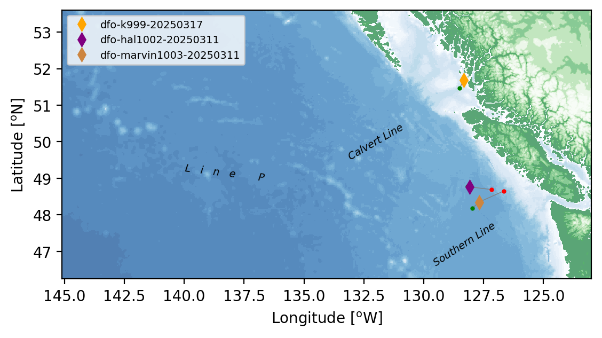
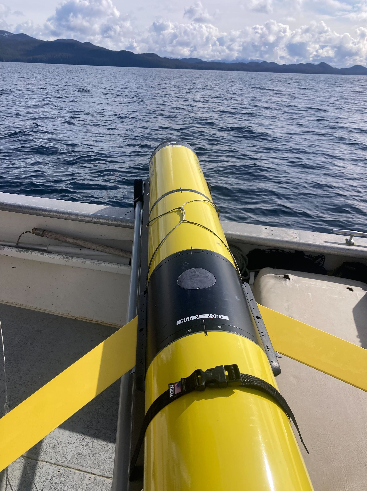

<!-- Start Writing Below in Markdown -->

For a couple of days, C-PROOF had zero gliders in the water for the first time in a number of months.  Planned (and semi-planned) recoveries and a delayed deployment meant we didn't have any gliders in the water.

However, now we are back to having three gliders in the water.  Nick worked with Bamfield again to deploy `dfo-hal` and `dfo-marvin` from Barkley Sound, crossing the Vancouver Island Shelf.  `dfo-marvin` is headed offshore on the Southern line, and will likely only complete one circuit before we turn arround in about 4 weeks.  `dfo-hal` is enroute to Calvert Island, via Line P.  He will drive along LineP until P16, and then return to Calvert Island, making a V-shape transit.

We are particularly excited about these deployments as they both had improved oxygen integrations, designed to overcome a high failure rate we have been having with oxygen sensors.  `dfo-hal` has the same oxygen sensor placement as previous deployments, but augmented by a brace to protect the cable from flexing.  This "fix" worked on a previous deployment, so we are optimistic we will get good data this deployment.  `dfo-marvin` has the oxygen sensor deplyed in a new location, outside the cowling and near the tail (see the glider on the right, above).  The goal is to avoid the cable being flexed, and ideally to capture some in-air oxygen data during the deployment.

Finally our colleagues at Hakai Institute picked up `dfo-k9` at Calvert island, checked him out, recharged him, and redeployed in Fitz Hugh Sound.  `dfo-k9` is being replaced by `dfo-hal` on the Calvert Line, so `dfo-k9` will head out to P16, and return along Line P, doing the reverse path of `dfo-hal`.

Fingers crossed that things go well - spring is an important time of year, with restratification, adn setting primary productivity for the coming year.