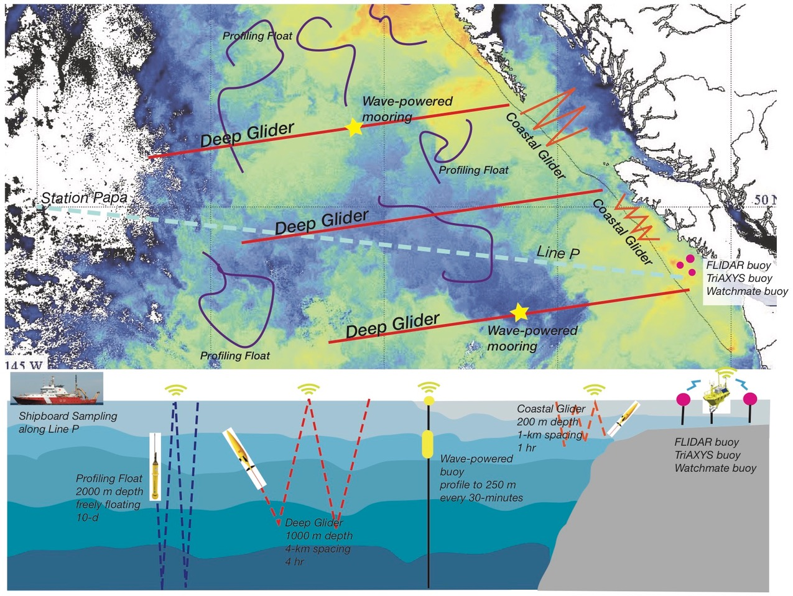

The Canadian Pacific Robotic Ocean Observing Facility uses state of the art technology to observe changes in the Northeast Pacific Ocean. The ocean and marine ecosystems are still poorly understood in many areas largely because of a lack of data. C-PROOF works to understand what drives ocean and climate variability, and our data is used to better predict weather and climate changes across Canada. Additionally, we collaborate with our partners to improve timely predictions of fish stocks so that economic and ecological concerns can be properly addressed. We also want to explore the ocean’s potential as a source of energy, which will help remote coastal communities and the country as a whole move towards carbon-free energy sources that rely on ocean waves and wind.

<figure>

<figcaption style="text-align:center;font-style: italic;font-size: 16px;">Diagram showing C-PROOF’s long-term vision for observing the Northeast Pacific Ocean, which includes a fleet of autonomous ocean gliders, profiling floats, wave-powered moorings, and buoys in coastal waters.</figcaption>
</figure>

### What we do

C-PROOF deploys [autonomous ocean gliders and floats](./platforms/) to explore and monitor the ocean. These instruments are equipped with revolutionary new sensors capable of tracking life, measuring ocean nutrients, and quantifying ocean turbulence. We also plan to deploy mooring arrays with innovative instrumentation. Our data is publicly available and is shared with a wide array of partners and user groups for the benefit of Canadians; the data is used to inform ecosystem management, climate predictions, and weather forecasts. C-PROOF helps provide the information we need to make better plans for the future, and helps drive development of the technological solutions needed to enable those plans.

### Equity, Diversity, Inclusion, and Accessibility Statement

The members of the C-PROOF project embrace diversity and are committed to fostering a culture of belonging that enhances our ability to serve the global ocean science community. Achieving a comprehensive understanding of the ocean and its systems requires a diversity of perspectives and an equitable, inclusive approach. By removing barriers to participation, we collectively advance knowledge and create a more just and innovative scientific community.

Recognizing this, we actively work to integrate equity, diversity, inclusion, and accessibility (EDIA) into our programs, decision-making, and organizational culture. We value and encourage Indigenous Peoples, racialized persons, women, persons with disabilities, and individuals of diverse sexual and gender identities to fully participate in C-PROOF. Diverse perspectives, experiences, and expertise are essential to strengthening our mission.

Our commitments include:

- Building an inclusive environment – We strive to create a respectful, welcoming space where all individuals feel valued and supported in their work. Respect includes listening actively, engaging thoughtfully, and ensuring all voices are heard.
- Increasing equitable access – We work to make our research and data openly accessible, removing systemic barriers to participation. This includes developing community-friendly, scalable data-sharing tools and supporting Indigenous-led research initiatives with our partners.
- Sustaining meaningful relationships – We acknowledge and respect the Indigenous Peoples whose territories span the west coast of British Columbia, including the Homalko, Heiltsuk, Ts'msyen, Maa-nulth, Musqueam, Squamish, and Haida Nations, among many others. Their deep relationships with the land and ocean continue to this day, and we seek to foster lasting, reciprocal partnerships that uphold Indigenous knowledge and stewardship.
- Fostering accountability and continuous learning – This is a living commitment. We pledge to revisit and refine our approach regularly, ensuring we continue to grow and respond to the evolving needs of our community. We encourage all team members to participate in anti-discrimination and equity training.
- Supporting well-being and peer mentorship – We recognize that impactful research requires a strong foundation of personal and professional support. We encourage self-care, value peer mentorship, and emphasize collective success.
- Practicing environmental and scientific integrity – We uphold the highest standards of ethical research, transparency, and respect for the environments in which we work. Our commitment to sustainability extends to minimizing the environmental impact of our research practices.

Finally, we recognize that learning and growth are ongoing. We acknowledge that mistakes will happen, and we treat these as opportunities to reflect, improve, and strengthen our shared commitment to equity, diversity, and inclusion.

### [In The News](/search/)

<!-- Updated: Show date and author for each news item -->

<ul class="post-preview">   <!---post-preview  -->
    <a href="{{ post.url }}">
        <h4 class="post-title">  {{ post.title }}
        </h4>
    </a>
    
{{ post.subtitle }}

    

      {{ post.date }}
       by {{ post.author }}
    

</ul>



### Publications

If you use C-PROOF data, please cite: Klymak, J., & Ross, T. (2025). C-PROOF Underwater Glider Deployment Datasets [Data set]. Canadian-Pacific Robotic Ocean Observing Facility. [doi:10.82534/44DS-K310](https://doi.org/10.82534/44DS-K310).

G. Han, J. M. Klymak, T. Ross, and N. Chen, 2026: Validation of 1-day repeat SWOT measurements against tide-gauge and glider data off Canada's West Coast. <em>Geophy. Res. Lett.</em>, <a href="https://doi.org/10.1029/2025GL119491">doi:10.1029/2025GL119491</a>

Talbot, L. C., J. M. Klymak, T. Ross, and G. Han, 2026: Two Lateral Stirring Regimes in the Northeast Pacific. <em>JGR Oceans</em>, 131, e2025JC023699, <a href="https://doi.org/10.1029/2025JC023699">doi:10.1029/2025JC023699</a>

Stevens, S. W., C. Hannah, W. Evans, J. Klymak, S. Waterman, and T. Ross, 2025: Dissolved Oxygen Variability on the Canadian Pacific Shelf: Trends, Drivers, and Projections in the Context of Emerging Hypoxia in Queen Charlotte Sound. <em>Global Biogeochemical Cycles</em>, 39, e2025GB008608, <a href="https://doi.org/10.1029/2025GB008608">doi:10.1029/2025GB008608</a>.

Hare, A. A., W. Evans, H. V. Dosser, J. M. Jackson, S. R. Alin, C. Hannah, T. Ross, and J. M. Klymak, 2025: Regression-based characterization of the marine carbonate system across shelf and nearshore waters of Queen Charlotte Sound. <em>Marine Chemistry</em>, 270, 104511, <a href="https://doi.org/10.1016/j.marchem.2025.104511">doi:10.1016/j.marchem.2025.104511</a>.

Ross, T., H. V. Dosser, J. M. Klymak, W. Evans, A. Hare, J. Jackson, and S. Waterman, 2025: Ocean Gliders for Planning and Monitoring Remote Canadian Pacific Marine Protected Areas. <em>Oceanography</em>, 38(1), 104-114, <a href="https://doi.org/10.5670/oceanog.2025e104">doi:10.5670/oceanog.2025e104</a>.

Wong, A. P. S., et al., 2020: Argo Data 1999–2019: Two Million Temperature-Salinity Profiles and Subsurface Velocity Observations From a Global Array of Profiling Floats. <em>Frontiers in Marine Science</em>, 7, <a href="https://www.frontiersin.org/article/10.3389/fmars.2020.00700">doi:10.3389/fmars.2020.00700</a>.

Roemmich, D., et al., 2019: On the Future of Argo: A Global, Full-Depth, Multi-Disciplinary Array. <em>Frontiers in Marine Science</em>, 6, <a href="https://www.frontiersin.org/article/10.3389/fmars.2019.00439">doi:10.3389/fmars.2019.00439</a>.

Testor, P., et al., 2019: OceanGliders: A Component of the Integrated GOOS. <em>Frontiers in Marine Science</em>, 6, <a href="https://www.frontiersin.org/article/10.3389/fmars.2019.00422">doi:10.3389/fmars.2019.00422</a>.

Barth, J. A., et al., 2019: Better Regional Ocean Observing Through Cross-National Cooperation: A Case Study From the Northeast Pacific. <em>Frontiers in Marine Science</em>, 6, <a href="https://www.frontiersin.org/article/10.3389/fmars.2019.00093">doi:10.3389/fmars.2019.00093</a>.

### Presentations

If you use C-PROOF data in a presentation, please let us know at [cproof@uvic.ca](mailto:cproof@uvic.ca).

Kheradmand S, Hamme RC, Low Oxygen Utilization Rate below the mixed layer using BGC-Argo float data in Northeast Pacific Ocean.  *Ocean Sciences Meeting, 2026*

Amidon CH, Hamme RC, In-situ Oxygen Calibration on BGC-Argo. *Ocean Sciences Meeting, 2026*

Talbot et al, Two Lateral Stirring Regimes in the Northeast Pacific, *Ocean Sciences Meeting, 2026*

Berden et al, The Role of a Cuddy in the Northeast Pacific in Driving Offshore Export and Retaining Nearshore Water,  *Ocean Sciences Meeting, 2026*

Ross et al 2026, Review of temperature, salinity and density of the northeastern Pacific in 2025 using Argo, glider, satellite and Line P data, *State of the Pacific Ocean meeting, 2026*

Kheradmand S, Hamme RC, *Canadian Meteorological and Oceanographic Society Congress* (May 2025) Saskatoon, SK. Poster: Low oxygen utilization rate below the mixed layer using BGC-Argo float data in Northeast Pacific Ocean

Koopmans E (UG presenter),Hamme RC, *Canadian Meteorological and Oceanographic Society Congress* (May 2025)  Poster: Ocean optics: Development of glider-based productivity analysis in BC waters using backscatter.

Ross et al 2025, Review of temperature, salinity and density of the northeastern Pacific in 2024 using Argo, glider, satellite and Line P data, *State of the Pacific Ocean meeting, 2025*

Klymak et al, 2024, <a href="./talks/SOPOPoster2024.pdf">2023 State of the NEP Meso- and Submesoscales</a>, <strong>State of the Pacific Ocean meeting, 2024</strong>

Ross et al 2024, Review of temperature, salinity and density of the northeastern
Pacific in 2023 using Argo, glider, satellite and Line P data, <strong>State of the Pacific Ocean meeting, 2024</strong>

Hannah et al, Subsurface ocean conditions on the B.C. shelf: the B.C. shelf mooring
program, <strong>State of the Pacific Ocean meeting, 2024</strong>

Dosser et al, Oxygen in 2023 from Line P, La Perouse, and Queen Charlotte Sound  <strong>State of the Pacific Ocean meeting, 2024</strong>

Pena et al, Nutrients and chlorophyll in the northeastern Pacific in 2023 using
Line P and glider data, <strong>State of the Pacific Ocean meeting, 2024</strong>

Lee et al, 2023 Ocean conditions in Gwaii Haanas and Haida Gwaii Chaan
sk̲’ada gud ahl hlɢ̲unggulaa | Tang.ɢ̲wan ɢ̲an gud ad hlɢ̲ang.gulx̲a
Working Together Ocean Sciences Expedition, <strong>State of the Pacific Ocean meeting, 2024</strong>

Sandwith et al, Detection of high-frequency biogeochemical events and
their physical forcings in the Northern Strait of Georgia, <strong>State of the Pacific Ocean meeting, 2024</strong>
